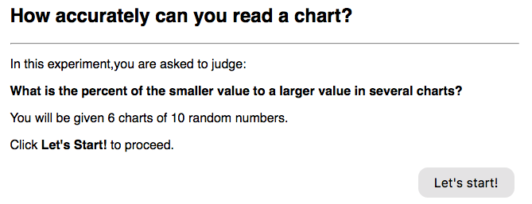
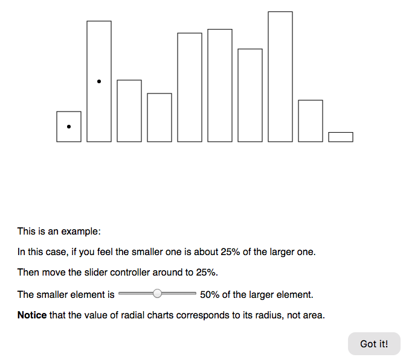
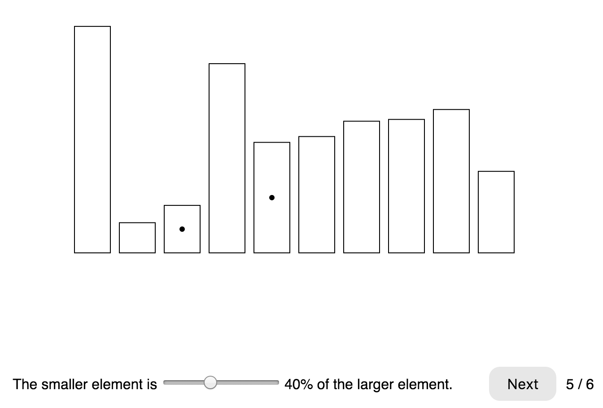
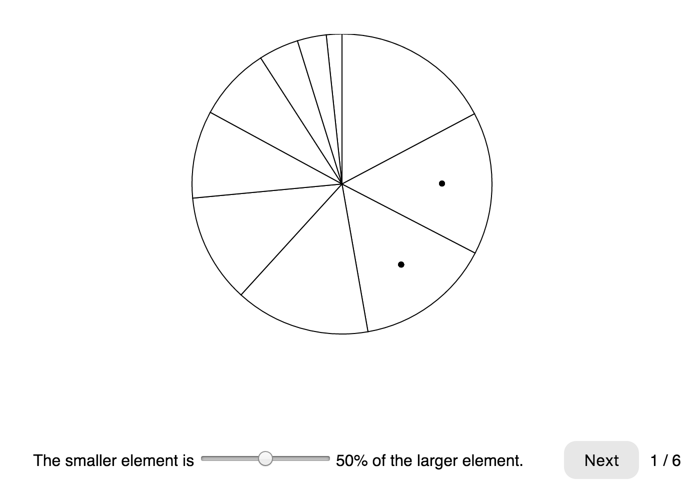
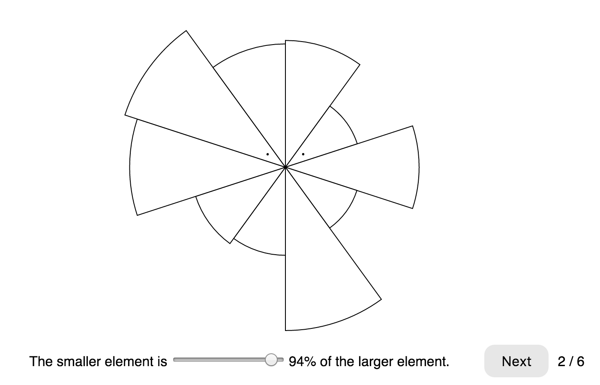
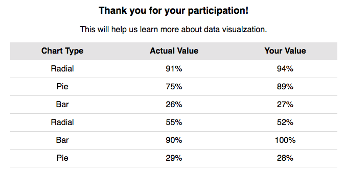
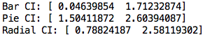

# Assignment 4 - Replicating a Classic Experiment  
---
- Team:
  - Boya Zhou, boyazhou1993
  - Yuting Liang, DarienLiang
- Click **[HERE](https://boyazhou1993.github.io/04-Experiment/templates/index.html)** to access the experiment.

## Description
We replicated the classic experiment originally implemented by Cleveland and McGill (1984). In this experiment, each participants are given 6 visualizations including 3 types of charts: **bar chart**, **piee chart** and **radial chart**. All results are stored in the server served by our PC using Flask.

## Welcome Page

## User Guide Page

## Bar Chart 

## Pie Chart

## Radial Chart

## Result and Thanks

## Results of CI
The Bootstrapped 95% Confidence Intervals of the three charts:

## Technical Achievements
- We set up a server to collect experiment results using our PC by Flask and AJAX.
- **Latin Square design** was implemented in this experiment to ensure that the 60 trials are counterbalanced
- use jQuery to implement interactive visulazation
- use d3 to implement 3 reuseable data chart
- use CSS to beautify our website

## Design Achievements
- 2 elementary tasks are involved in this experiment: 
  - **Position**: Bar Chart, Radial Chart
  - **Angle**: Pie Chart
- Friendly interfere without any extra information
- clean and tidy design(at least we think...)

## Collaboration
- Boya Zhou
  - Compiled and modularized the experiment process
  - Implemented Latin Square design to ensure that the 60 trials are counterbalanced
  - Figured out how to store participants' results
- Yuting Liang
  - Made three reuseable visualizations
  - Made analysis on experiment results
  - use CSS to modify the website 

#### Reference
- http://hamsterandwheel.com/grids/index2d.php
- https://benmcmorran.github.io/04-Experiment/
- https://developer.mozilla.org/en-US/docs/Web/JavaScript/Reference/Global_Objects/Math/random
- http://stackoverflow.com/questions/1051061/convert-json-array-to-an-html-table-in-jquery
- https://bl.ocks.org/bricedev/8aaef92e64007f882267

Notice that we reference one of our classmates high quality homework. We reference the range button idea and the result table idea. 
